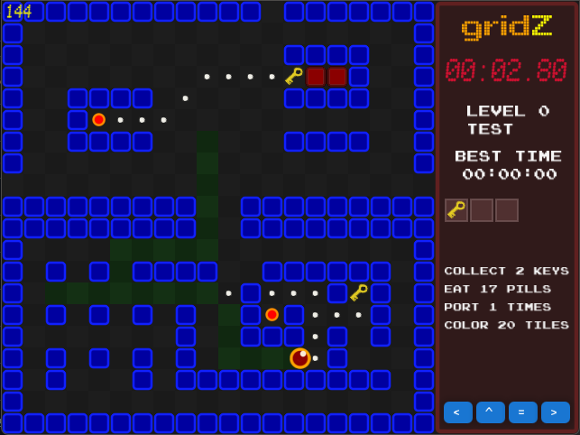

# Just playing around with KorGE

`gridZ` is a little test project to play around with the multiplatform game engine [KorGE](https://korge.org/). I have a little sandbox maze game in mind, with lots of mechanics. Not really a puzzler, but more like a speed-runner, hunting for the best time.

You can try a snapshot of the game (maybe not the latest version) here:
http://www.gnu.at/gridz
or download the JAR-file:
http://www.gnu.at/gridz.jar



Run with
- `./gradlew :runJvm`
- `./gradlew :runJsRelease` -> installs to `./build/www/` (open the listed URL in a browser)

---

Control the character with:

### Gamepad

- left stick to move
- `A` to go to next level after current level completed
- `B` reset the current level
- `Start` pause (toggle)
- `LB` previous level
- `RB` next level

### Mouse

- press and hold the right mouse button to move
- press the left mouse button to go to next level after current level completed

### Keyboard (not recommended)

- use the arrow keys to move
- `B` previous level
- `N` next level
- `Enter` reset the current level
- `Space` go to the next level after current level completed
- `P` pause (toggle)
- `Esc` end the game and close the window

---

Create an executable JAR-file with:
- `./gradlew :packageJvmFatJar` -> `./build/lib/gridz-all.jar`

---

To deploy an Android app:
- Enable `targetAndroid()` in `build.gradle.kts`
- Create a file `local.properties` with the following content (use your local Android-SDK installation path):
```sdk.dir=C\:\\Users\\myuser\\AppData\\Local\\Android\\Sdk```
- Pair your Android device (get the IP and port from the development settings after enabling WLAN-debugging)
```
adb pair <ip>:<port>
adb connect <ip>:<port>
adb devices
```
- `./gradlew :runAndroidRelease`
